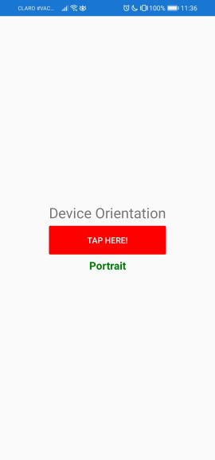
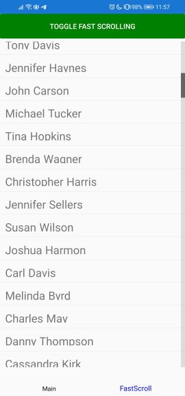

# Miscellaneous Projects

Project based on practical assignment #7 for the class "Desarrollo de Aplicaciones Móviles" from INTEC. The purpose of this project is two explore the following features in Xamarin:

- Dependency Service
- Custom Renderers
- Effects
- Platform Specifics

## Dependency Service

Service specific per platform to obtain the orientation of the device

## Custom Renderers

Custom renderer which changes the background color of the `Entry` control

## Effect

Similar to previous app, implements custom background color of the `Entry` control. However, once tapped, it default to white.

Custom effect color | Default color 
:------------------:|:-------------:
 | 

## Platform specifics

Implement to platform specific features from Android: 
- Toolbar placement
- Fast scrolling

Toolbar placement | Fast scrolling deactivated | Fast scrolling activated
:-----------------|:--------------------------:|:------------------------:
 |  | 